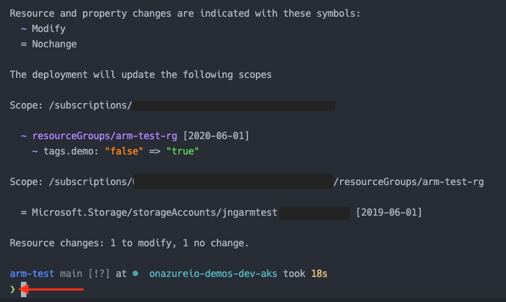

# ARM `what-if` Test

### Goal

Does `what-if` use an exit code so we can automate checking for configuraiton drift without analyzing output?

### Result - Nope

- To detect programmatically detect configuration change, you would need to process result output 😕
- Green means exit code 0. I want a non-zero exit code like Terraform's `-detailed-exitcode` flag

### References

- [Azure Docs: ARM template deployment what-if operation](https://docs.microsoft.com/en-us/azure/azure-resource-manager/templates/template-deploy-what-if?tabs=azure-cli)
- [Azure CLI Reference: az deployment sub what-if](https://docs.microsoft.com/en-us/cli/azure/deployment/sub?view=azure-cli-latest#az_deployment_sub_what_if)

